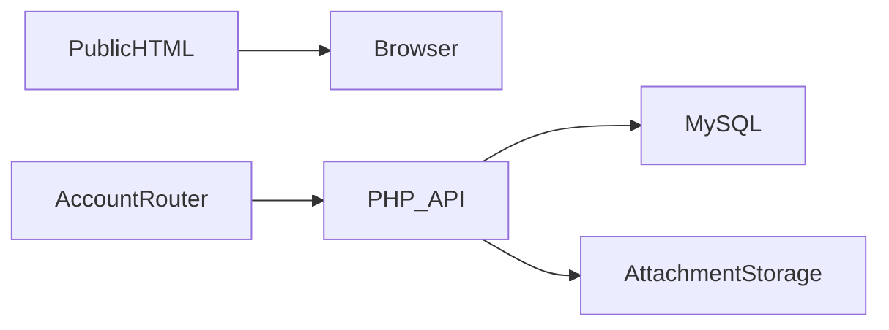

# دينكو

**موقع استوديو برمجي وبوابة عملاء عربية**

[English](README.md)

ربط موقع الاستوديو العام بطلبات العملاء ومحادثات المشاريع ومتابعة الإدارة.

**التقنيات:** Vanilla JavaScript · PHP · MySQL · modular CSS

## الحالة والتاريخ

موقع استوديو وبوابة عملاء نُشرا واختُبرا سابقاً.

هذه نسخة عرض منقحة للنشر. تعرض [وثيقة التحقق](docs/verification.md) الفحوص الحالية بصورة مستقلة عن النشر السابق.

## الوظائف والإجراءات

- صفحات تعريف وفريق وقوالب عامة
- تسجيل العملاء واستقبال الطلبات والتذاكر
- غرف عمل ومحادثات ومرفقات وإشعارات
- تقييمات واشتراكات وإجراءات إدارة
- تخطيط عربي RTL وتفضيل مظهر محفوظ وسجل نشاط

يستكشف الزائر خدمات الاستوديو ← يرسل العميل طلباً ← يتبادل العميل والإدارة الرسائل والملفات في غرفة العمل ← تحافظ الإشعارات والحالات على متابعة العمل.

## البنية

## القرارات الهندسية

- تختلف الصفحات العامة HTML عن موجه حساب العميل؛ الموقع كله ليس تطبيق SPA موحداً.
- تعتمد العودة في المتصفح على المسار الحالي عند غياب حالة history، وتُحوّل مسارات app/index إلى اللوحة.
- يحل Apache مسارات HTML العامة قبل تطبيق الحساب. تبقى صلاحيات API والمرفقات مسؤولية الخادم.
- يجب تطبيق ملكية التذكرة على الرسائل والملفات أيضاً. العدادات التقديمية ليست دليلاً على نشاط فعلي.

## المجلدات

| Component | Responsibility |
|---|---|
| `js/` | Router, page controllers and UI modules |
| `css/` | Modular RTL presentation |
| `api/` | PHP authentication, tickets, chat, files and administration |
| `database.sql` | Base schema |
| `database_updates.sql` | Incremental schema changes |

## التثبيت والإعداد

استخدم PHP مع PDO MySQL وcURL وfileinfo وMySQL. استورد `database.sql` ثم `database_updates.sql` مع فحص المخطط قبل إعادة التحديثات. اضبط متغيرات قاعدة البيانات ومفتاح JWT جديداً. يلزم Apache مع mod_rewrite للمسارات النظيفة؛ خادم PHP التطويري لا يقرأ `.htaccess`. اضبط reCAPTCHA للمصادقة الحقيقية وصلاحيات مجلد الملفات.

توجد أوامر التشغيل ومتغيرات البيئة في [دليل الإعداد](docs/setup.ar.md). القيم أمثلة محلية أو حقول فارغة؛ لا تعِد استخدام بيانات إنتاج سابقة.

## العرض والتحقق

يستكشف الزائر خدمات الاستوديو ← يرسل العميل طلباً ← يتبادل العميل والإدارة الرسائل والملفات في غرفة العمل ← تحافظ الإشعارات والحالات على متابعة العمل.

استخدم حسابات وسجلات اصطناعية. راجع [خطوات العرض](docs/demo.ar.md) وسجل نتائج الفحوص الحالية. نجاح بناء مكون لا يثبت نجاح كل مسارات المنتج.

## الحدود

تحتاج إجراءات العميل الكاملة إلى MySQL ومصادقة مهيأة. يجب وسم العدادات التجريبية. استُبعدت المرفقات الخاصة وإعدادات SFTP.

## التوثيق

- [البنية](docs/architecture.ar.md)
- [الإعداد](docs/setup.ar.md)
- [العرض](docs/demo.ar.md)
- [المسارات](docs/api.md)
- [الفحوص الحالية](docs/verification.md)
- [النشر وحل المشكلات](docs/deployment.md)
- [حقوق الأصول](THIRD_PARTY_NOTICES.md)

## المساهمة والترخيص

افتح مشكلة تتضمن خطوات إعادة الإنتاج والمكون المعني. استخدم بيانات اصطناعية وتعديلات مركزة وفحوصاً مناسبة، ولا ترسل أسراراً أو سجلات مستخدمين خاصة. الشيفرة بترخيص [MIT](LICENSE)، وتحتفظ الاعتماديات والأصول الخارجية بشروطها الأصلية.
