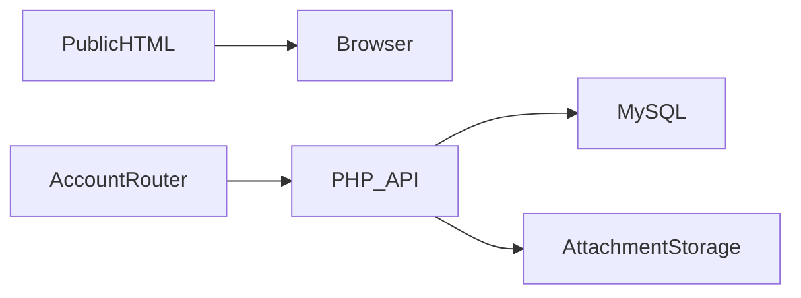
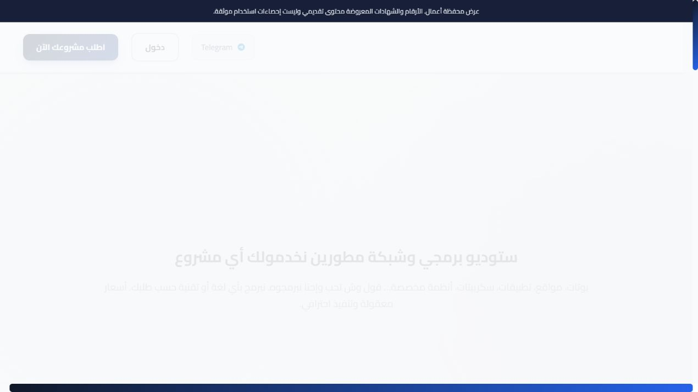

# Deinkow

**Arabic software studio and client portal**

[العربية](README.ar.md)

Connect a public studio website to structured client requests, project conversations and administrative follow-up.

**Technology:** Vanilla JavaScript · PHP · MySQL · modular CSS

## Status and deployment history

Previously deployed and tested studio website and client portal.

This is a sanitized portfolio release. See the current [verification record](docs/verification.md) before choosing a runtime demonstration.

## Main workflows and implemented features

- Public marketing, team and template pages
- Client registration and project/ticket intake
- Workrooms, conversations, attachments and notifications
- Ratings, subscriptions and administrative workflows
- Arabic RTL layouts, theme persistence and activity logging

Visitor explores studio services → client submits a request → client and administrator exchange messages/files in its workroom → notifications and status updates maintain continuity.

## Architecture

## Engineering decisions

- Public HTML pages and the client-side account router serve different purposes. The entire website is not one uniform SPA.
- History navigation now falls back to the current path when popstate has no route state; app/index paths normalize to the dashboard.
- Apache resolves existing public HTML routes before the account application fallback. API and attachment authorization remain server responsibilities.
- Ticket ownership must apply to messages and files as well as ticket metadata. Generated presentation counters are not operational evidence.

## Directory guide

| Component | Responsibility |
|---|---|
| `js/` | Router, page controllers and UI modules |
| `css/` | Modular RTL presentation |
| `api/` | PHP authentication, tickets, chat, files and administration |
| `database.sql` | Base schema |
| `database_updates.sql` | Incremental schema changes |

## Installation

Use PHP with PDO MySQL, cURL and fileinfo plus MySQL. Import `database.sql` before `database_updates.sql`, inspecting existing schema before applying updates again. Export `DB_HOST`, `DB_NAME`, `DB_USER`, `DB_PASS` and a fresh `JWT_SECRET`. Apache with mod_rewrite supports clean URLs; the PHP development server alone does not interpret `.htaccess`. Configure reCAPTCHA for real authentication. Keep upload paths writable and protect private attachment access.

All required/private configuration is described in [setup](docs/setup.md). Examples contain placeholders or local demo values. Never reuse historical credentials.

## Demonstration

- Create a synthetic client and request.
- Exchange a message and harmless attachment from the client workroom.
- Open the request as administrator and change its status.
- Refresh direct public/account routes and verify browser back/forward and foreign-ticket rejection.

## Verification and limitations

- PHP syntax
- Direct route, refresh and browser history behavior
- Client ticket and attachment isolation
- Administration permissions

Full client workflow requires a fresh MySQL schema and configured authentication. Demo counters must be labelled. Private uploads and original SFTP configuration are excluded.

## Documentation

- [Architecture](docs/architecture.md) · [العربية](docs/architecture.ar.md)
- [Setup and configuration](docs/setup.md) · [العربية](docs/setup.ar.md)
- [Demo walkthrough](docs/demo.md) · [العربية](docs/demo.ar.md)
- [API and execution paths](docs/api.md)
- [Verification record](docs/verification.md)
- [Deployment and troubleshooting](docs/deployment.md)
- [Asset attribution](THIRD_PARTY_NOTICES.md) · [MIT license](LICENSE)

## Contributing

Open an issue describing a reproducible problem, expected behavior and component involved. Use synthetic data. Keep changes focused and include relevant checks. Do not include credentials or private user records.

## License and attribution

Source code is MIT licensed. Third-party dependencies and assets retain their own terms; see [attribution](THIRD_PARTY_NOTICES.md).

<!-- release-presentation -->

## Actual application interface

Captured from the local application with synthetic records. This does not establish production usage or Android device verification.

## Verification and deeper reading

Fresh MariaDB schema/bootstrap and PHP syntax checks passed. HTTP checks passed client/admin login, request and message creation, foreign ticket/chat rejection, validated text attachment upload, blocked direct attachment access, authorized download and unauthorized download rejection. Browser review exposed and repaired login aliases and the demo CAPTCHA dependency.

The public site and client portal mix standalone HTML pages and client-side routing; do not describe every route as one SPA. CAPTCHA and mail/provider configuration require fresh live credentials. Additional browser-history and administrative workflows remain to be checked.

- [Case study](docs/case-study.md)
- [Verification](docs/verification.md)
- [Architecture diagram](docs/architecture.svg)
- [Portfolio case study](https://mohamed-abderrehmane-portfolio.hillock-factual9mupt.chatgpt.site/projects/deinkow/)

- [Interface walkthrough and video](docs/walkthrough.md)
