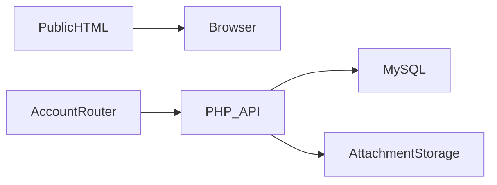

# بنية دينكو

يستكشف الزائر خدمات الاستوديو ← يرسل العميل طلباً ← يتبادل العميل والإدارة الرسائل والملفات في غرفة العمل ← تحافظ الإشعارات والحالات على متابعة العمل.

## القرارات والمفاضلات

- تختلف الصفحات العامة HTML عن موجه حساب العميل؛ الموقع كله ليس تطبيق SPA موحداً.
- تعتمد العودة في المتصفح على المسار الحالي عند غياب حالة history، وتُحوّل مسارات app/index إلى اللوحة.
- يحل Apache مسارات HTML العامة قبل تطبيق الحساب. تبقى صلاحيات API والمرفقات مسؤولية الخادم.
- يجب تطبيق ملكية التذكرة على الرسائل والملفات أيضاً. العدادات التقديمية ليست دليلاً على نشاط فعلي.

## مراجع الشيفرة

- [js/router.js](../js/router.js)
- [api/config.php](../api/config.php)
- [database.sql](../database.sql)
- [database_updates.sql](../database_updates.sql)

## الحدود

تحتاج إجراءات العميل الكاملة إلى MySQL ومصادقة مهيأة. يجب وسم العدادات التجريبية. استُبعدت المرفقات الخاصة وإعدادات SFTP.
