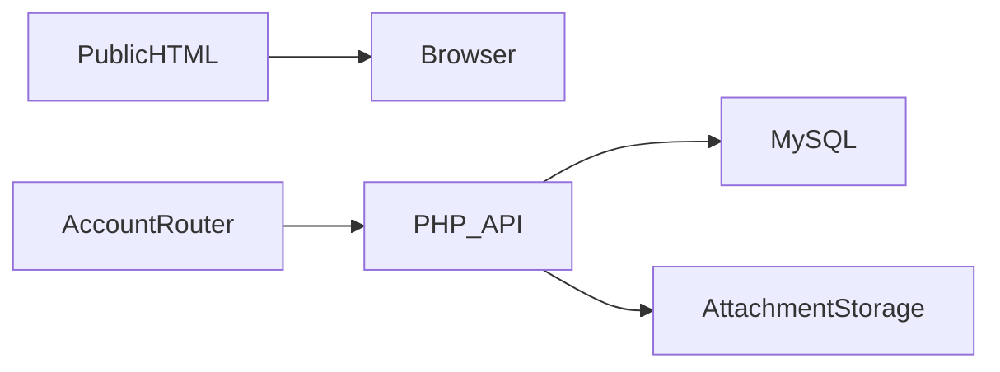

# Deinkow architecture

Visitor explores studio services → client submits a request → client and administrator exchange messages/files in its workroom → notifications and status updates maintain continuity.

## Decisions and tradeoffs

- Public HTML pages and the client-side account router serve different purposes. The entire website is not one uniform SPA.
- History navigation now falls back to the current path when popstate has no route state; app/index paths normalize to the dashboard.
- Apache resolves existing public HTML routes before the account application fallback. API and attachment authorization remain server responsibilities.
- Ticket ownership must apply to messages and files as well as ticket metadata. Generated presentation counters are not operational evidence.

## Component boundaries

| Component | Responsibility |
|---|---|
| `js/` | Router, page controllers and UI modules |
| `css/` | Modular RTL presentation |
| `api/` | PHP authentication, tickets, chat, files and administration |
| `database.sql` | Base schema |
| `database_updates.sql` | Incremental schema changes |

## Source evidence

- [js/router.js](../js/router.js)
- [api/config.php](../api/config.php)
- [database.sql](../database.sql)
- [database_updates.sql](../database_updates.sql)

## Limits

Full client workflow requires a fresh MySQL schema and configured authentication. Demo counters must be labelled. Private uploads and original SFTP configuration are excluded.
